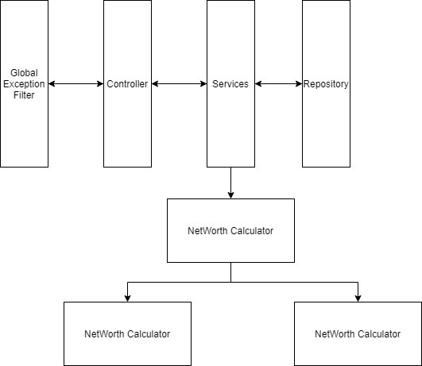

# Architecture Design Record for Backend

## Objective

To come up with a choice of technology for networth's Backend.

## Decision

All three frameworks Spring Boot, Asp.Net Core, and Node with Exprees/Hapi are great solutions.

Considering Intuit's current ecosystem of Java and Spring Boot. The decision is to use Spring Boot with Java 8.

Although, .Net Core's performance benchmarks beat Java and Node. But Tooling around .Net core is still in VSCode. This is mitigable as all languages have first class support in VSCode now ( which is free.)

Good Mvc Support
Dependency Injection
Routing
Configurable
X Async/Await are first class citizens of .NET Core framework and Node. .Net core works across cores.
Higer Order Functions are now supported in all languages.

## Sequence

